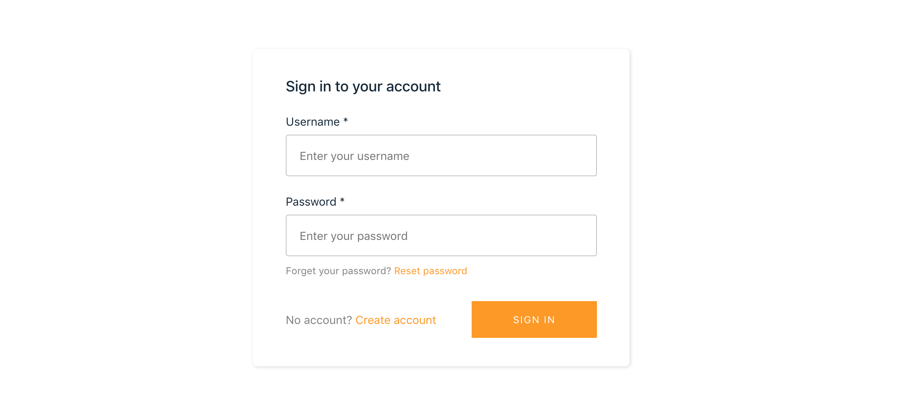

Now that our project is set up, the first thing we'll do is add authentication. This way we can keep track of which photos belong to which users, as well as make sure only people registered for the app can upload photos.

## How Authentication Works in Amplify

The Amplify Framework uses [Amazon Cognito](https://aws.amazon.com/cognito/) as the main authentication provider. Amazon Cognito is a robust user directory service that handles user registration, authentication, account recovery & other operations. In this tutorial, you'll learn how to add authentication to your application using Amazon Cognito and username/password login.

## Add Authentication to the App

We'll use the Amplify CLI to add the `auth` category to our project. From the root of your project, run the following:

```bash
amplify add auth
```

The CLI will prompt you for more information,

```bash
Do you want to use the default authentication and security configuration (default configuration)

How do you want users to be able to sign in (Username)

Do you want to configure advanced settings (No, I am done)
```

This will use the default settings in Cognito for username/password login. Now that we've defined our authentication needs it's time to deploy our Cognito user pool on AWS. To do that run:

```bash
amplify push
```

The Amplify `push` command takes the templates generated by the Amplify CLI and pushes them to the cloud. Your AWS resources are then updated to match the new requirements.

## Creating the Login View

Now that we have our authentication service deployed to AWS, it's time to add authentication to our React app. Creating the login flow can be quite difficult and time consuming to get right. Luckily Amplify Framework has an authentication component we can use that will provide the entire authentication flow for us, using our configuration specified in our `aws-exports.js` file.

In your editor, open up `src/App.js` and replace it with the following:

```javascript
import React from "react";
import "./App.css";
import { withAuthenticator } from "aws-amplify-react";

function App() {
  return (
    <div className="App">
      <header className="App-header">
        <p>
          Edit <code>src/App.js</code> and save to reload.
        </p>
        <a
          className="App-link"
          href="https://reactjs.org"
          target="_blank"
          rel="noopener noreferrer"
        >
          Learn React
        </a>
      </header>
    </div>
  );
}

export default withAuthenticator(App, true);
```

If you are running the app, you should already be greeted with a login screen. If you're not running the app, start it up and you should then see something like the image below:



Now that we have login support, go ahead and create a user. Once you successfully login, you should see the React boilerplate along with a new header and logout button. The header is part of the authentication component and can be customized or removed. We'll leave it here so we can focus on the photo sharing functionality.

In the next step, we'll set our data model and API so that we can upload and display photos.
